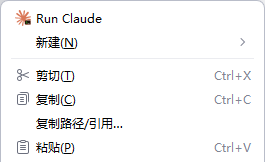
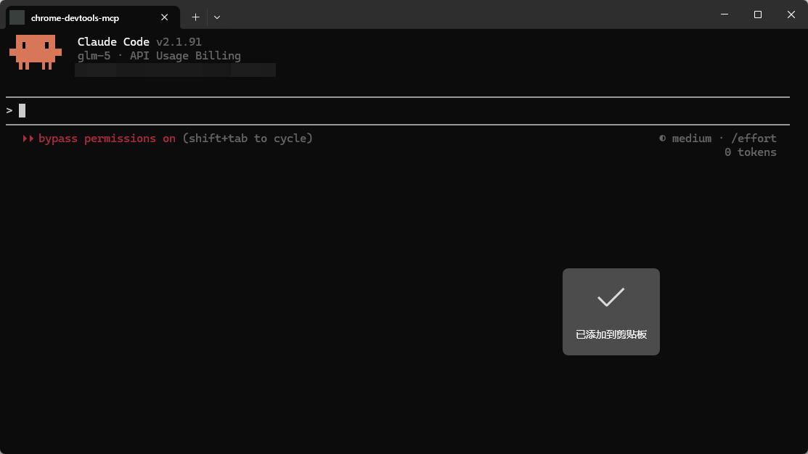
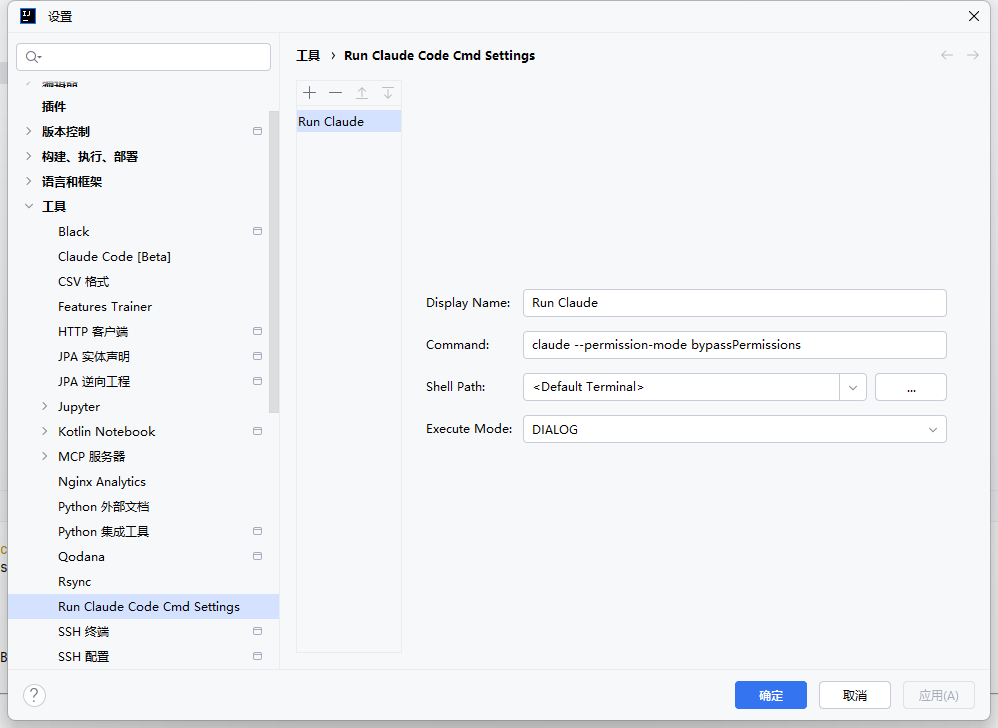

# Run Claude Code Cmd Any Where

An IntelliJ IDEA plugin that allows you to run Claude Code CLI commands in any directory with a right-click menu.

## Screenshots

| Right-click Menu | Settings | Execution |
|:---:|:---:|:---:|
|  |  |  |

## Features

- **Right-click menu integration** - Run commands directly from Project View
- **Customizable command presets** - Configure in Settings → Tools → Run Claude Code Cmd Settings
- **Multiple execution modes** - IDE Terminal or External Terminal window
- **Shell path selection** - Auto-detect system shells (CMD, PowerShell, Git Bash, WSL, etc.)
- **Auto version increment** - Version number increases by 0.0.1 on each build

## Installation

1. Download from JetBrains Plugin Repository (pending review)
2. Or manually install: `build/distributions/run-claude-code-cmd-anywhere-*.zip`

## Configuration

Go to **Settings → Tools → Run Claude Code Cmd Settings**:

- **Display Name**: Menu item name
- **Command**: CLI command to execute (e.g., `claude --permission-mode bypassPermissions`)
- **Shell Path**: Select from detected shells or enter custom path
- **Execute Mode**: 
  - `TERMINAL` - Run in IDE built-in terminal
  - `DIALOG` - Run in external terminal window

## Usage

1. Right-click on any directory/file in Project View
2. Select configured command from menu
3. Command executes in chosen directory

## Build

```bash
./gradlew buildPlugin
```

Plugin package: `build/distributions/run-claude-code-cmd-anywhere-*.zip`

## Publish

First time: Manual upload to https://plugins.jetbrains.com/author/me

Subsequent updates:
```bash
./gradlew publishPlugin -DpluginToken=YOUR_TOKEN
```

## License

MIT License - See [LICENSE](LICENSE)

## Author

Adbyte - https://adbyte.com