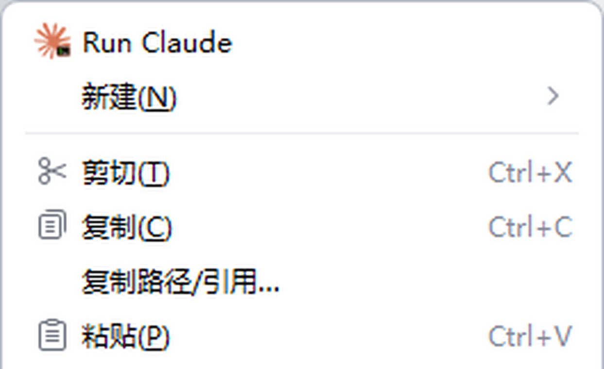
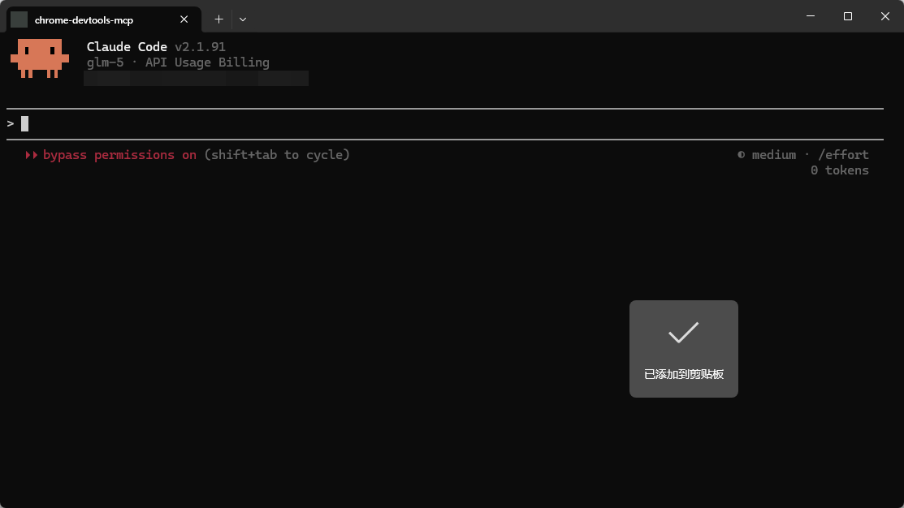
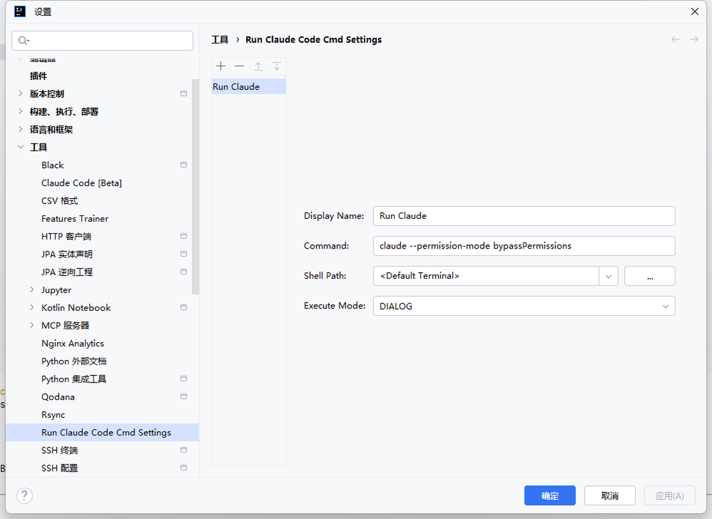

# Run Claude Code Cmd Any Where

An IntelliJ IDEA plugin that lets you run Claude Code CLI commands in any directory with a right-click menu, and generate Git commit messages with AI.

## Screenshots

| Right-click Menu | Settings | Execution |
|:---:|:---:|:---:|
|  |  |  |

## Features

### Run Claude Code Cmd

- **Right-click menu integration** - Run commands directly from Project View
- **Customizable command presets** - Configure in Settings → Other Settings → Run Claude Code Cmd
- **Multiple execution modes** - IDE Terminal or External Terminal window
- **Shell path selection** - Auto-detect system shells (CMD, PowerShell, Git Bash, WSL, etc.)
- **Auto version increment** - Version number increases by 0.0.1 on each build

### AI Git Commit

Generate Git commit messages with AI based on your code changes. Open the Commit dialog (`Ctrl+K`) and click **Generate AI Commit Message**; the result is filled into the commit message editor.

Supported LLM providers:

- DeepSeek
- Gemini
- SiliconFlow (Model Hub)
- Ollama
- OpenAI API
- Cloudflare Workers AI
- 阿里云百炼 (Model Hub)
- 火山引擎 (VolcEngine)
- OpenRouter
- Kimi (Moonshot AI)
- OpenAI Compatible LLMs

Default provider is 阿里云百炼 with model `qwen3-coder-flash`. Drop a `commit-prompt.txt` in the project root to enable a project-level prompt.

> The AI Git Commit feature is derived from [HMYDK/AIGitCommit](https://github.com/HMYDK/AIGitCommit)
> under AGPL-3.0. See [NOTICE.md](NOTICE.md) and [LICENSE-AGPL-3.0](LICENSE-AGPL-3.0).

## Installation

1. Download from JetBrains Plugin Repository: https://plugins.jetbrains.com/plugin/31067-run-claude-code-cmd-any-where
2. Or manually install: `build/distributions/run-claude-code-cmd-anywhere-*.zip`

## Configuration

Go to **Settings → Other Settings → Run Claude Code Cmd**. It contains two tabs:

- **AI Commit** - LLM provider, model, API key, language, custom prompts, file exclusion rules, proxy
- **Commands** - Right-click command presets

### Commands tab

- **Display Name**: Menu item name
- **Command**: CLI command to execute (e.g., `claude --permission-mode bypassPermissions`)
- **Shell Path**: Select from detected shells or enter custom path
- **Execute Mode**:
  - `TERMINAL` - Run in IDE built-in terminal
  - `DIALOG` - Run in external terminal window

## Usage

1. Right-click on any directory/file in Project View
2. Select configured command from menu
3. Command executes in chosen directory

## Build

```bash
./gradlew buildPlugin
```

Plugin package: `build/distributions/run-claude-code-cmd-anywhere-*.zip`

## Publish

First time: Manual upload to https://plugins.jetbrains.com/author/me

Subsequent updates:
```bash
./gradlew publishPlugin -DpluginToken=YOUR_TOKEN
```

## License

- Plugin own code: MIT License - See [LICENSE](LICENSE)
- `com.hmydk.aigit` package (AI Git Commit): GNU AGPL-3.0 - See [LICENSE-AGPL-3.0](LICENSE-AGPL-3.0) and [NOTICE.md](NOTICE.md)

## Author

Adbyte - https://adbyte.com
